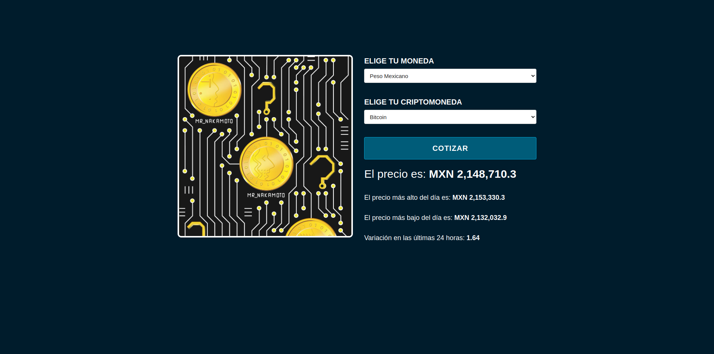

# Cryptocurrency Price Checker

A web application that allows users to check real-time prices of major cryptocurrencies using the CryptoCompare API.



## Features

- Real-time price checking
- Multiple fiat currency support
- Top 10 cryptocurrencies by volume
- Detailed information including:
  - Current price
  - Daily high price
  - Daily low price
  - 24-hour variation
- Intuitive user interface
- Loading indicator (spinner)

## Built With

- HTML5
- CSS3
- JavaScript
- CryptoCompare API

## Getting Started

### Prerequisites

- A modern web browser
- Internet connection

### Installation

1. Clone the repository:

   ```bash
   git clone https://github.com/JesusVirgen/cryptocurrencies.git
   ```

2. Navigate to the project directory:

   ```bash
   cd cryptocurrency-price-checker
   ```

3. Open `index.html` in your web browser

## Usage

1. Select your preferred fiat currency
2. Choose the cryptocurrency you want to check
3. Click the "Quote" button
4. Wait for the results to display

## API Reference

This project uses the CryptoCompare API. For more information, visit: https://min-api.cryptocompare.com/documentation

## Autors

Jesús Virgen
